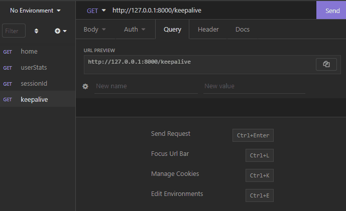

# RTB Task, Ron Raifer.
## _Given By [Start.io](https://start.io/)_
A little explanation


## Tech

RTB uses a number of open source projects to work properly:

- [Python](https://www.python.org/) - the programming language
- [FastAPI](https://fastapi.tiangolo.com/) - fast (high-performance), web framework for building APIs with Python 3.6+
- [DASK](https://dask.org/) - provides advanced parallelism for analytics
- [pydantic](https://pydantic-docs.helpmanual.io/) - enforces type hints at runtime, and provides user friendly errors when data is invalid
- [uvicorn](https://www.uvicorn.org/) - a lightning-fast ASGI server implementation, using uvloop and httptools
- [pytest](pytest.org) - framework makes it easy to write small tests


## Installation

This project requires [Python](https://www.python.org/) v3.6+ to run.

Clone the project or download it directly:
```bash
git clone https://github.com/ronraifer/RTB.git
cd RTB
```

Install the dependencies, using [pip](https://pypi.org/project/pip/), via running the next command:
```bash
 pip install -r requirements.txt
```

## Running the App

RTB Application works in two ways: running `main.py`, or via terminal using `uvicorn`.
This section will guide you and explain how to run the app in each mode.

#### !Run\Debug `main.py`

- Make sure you have [Insomnia](https://insomnia.rest/) or equivalent.
- Next, through your IDE or CMD, run ``main.py``
- The API is now reachable through ``http://127.0.0.1:8000``
- Open Insomnia, and add GET requests as your wish.
- Now tick the 'Send' button, and review the response.
- Example "degifted" below



#### !Run Via Terminal

Via terminal (IDE/cmd), enter the following:
```bash 
uvicorn main:app --reload 
```

Next, open your browser (or Insomnia), and navigate to:
```bash 
http://127.0.0.1:8000
```

Then, navigate to the desired request, with the relevant arguments:
```bash 
http://127.0.0.1:8000/keepalive
http://127.0.0.1:8000/userStats/?user_id=YOUR_USER_ID
http://127.0.0.1:8000/sessionId/?session_id=YOUR_SESSION_ID
```

## Swagger

To access the interactive API documentation, make sure the app is running, and then navigate to:
```bash 
http://127.0.0.1:8000/docs
```


## Further Improvements
What to improve


## Contact Info
Mail me: ronraifer@gmail.com


